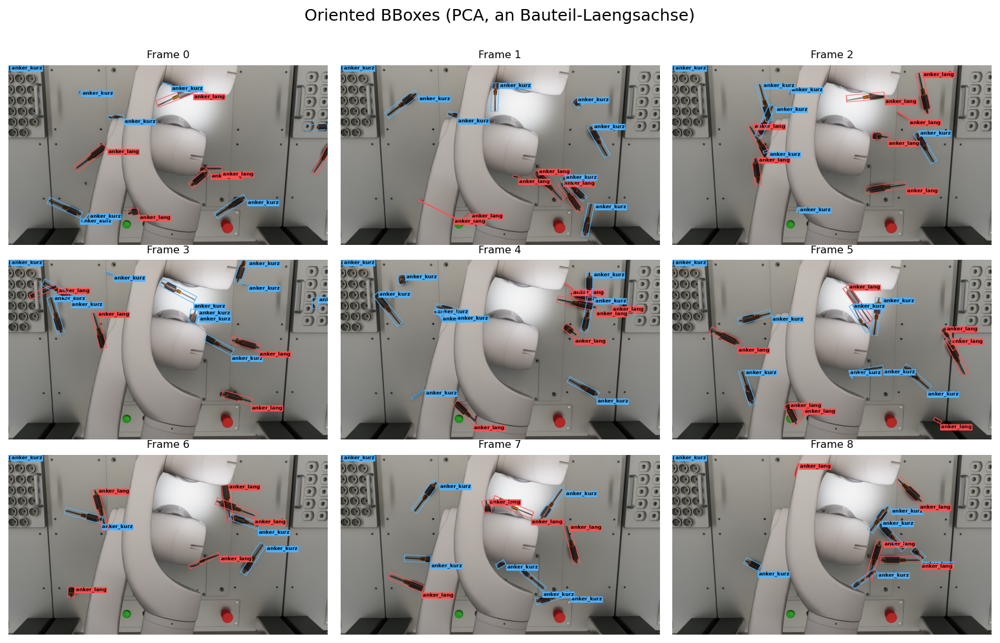

# KIP_POSE

6D pose estimation for robotic pick-and-place: a synthetic-data-generation
pipeline plus the surrounding ML/eval/visualization tooling for detecting and
posing parts (`Anker_Kurz`, `Anker_Lang`, …) on a tray so a robot arm can grasp
them.

## Example output

Synthetic top-down capture from the real Zivid camera in the assembled cell
(LARA5 robot arm in frame), parts physics-dropped and scattered across the
table at fixed real-world scale, with **oriented 2D bounding boxes** (rotated to
each part's long axis, PCA over the instance mask) — 9 frames showing the
physics variation:



## Repository layout

| Path | What |
|------|------|
| `sim_code/` | Synthetic-data-generation pipeline (NVIDIA **Isaac Sim** + Replicator) |
| `scripts/` | Workstation setup + remote-run harness (Wake-on-LAN → Tailscale → headless run) |
| `data/` | USD assets (`data/usd/`) and rendered datasets (`data/output/`) — git-ignored, delivered/generated separately |
| `konzept/` | Project concept document |
| `.research/` | State-of-the-art research brief |
| `.claude-project/` | Roadmap, phases and concept managed by the `claude-project` pipeline |
| `.claude-kanban/` | Live work board |

## Synthetic data generation (`sim_code/`)

Generates annotated training images from a USD scene: RGB, 2D bounding boxes,
semantic + instance segmentation and depth maps. Two spawn modes — `tray`
(parts placed in a grid of tray slots) and `random` (parts dropped with physics
settling).

- `datagenerationscript.py` — the original pipeline, made for the Isaac Sim
  **Script Editor** (interactive, async editor loop).
- `run_sdg.py` — **headless standalone runner** for the workstation; boots a
  `SimulationApp`, opens the scene and re-uses the same generation helpers.

Asset paths and output location are configurable via env vars
(`SDG_USD_DIR`, `SDG_OUTPUT_DIR`, `SDG_CAMERA_PATH`) or CLI flags on `run_sdg.py`.

## Running it

Isaac Sim 5.1 runs headless on the GPU workstation (Ubuntu 24.04, RTX 3090).

**One-time setup** (installs Isaac Sim into a Python 3.11 venv on `/mnt/data`):

```bash
bash scripts/setup_isaacsim_workstation.sh
# smoke test:
/mnt/data/isaacsim-venv/bin/python scripts/verify_isaacsim.py
```

**Minimal demo — simulation → top-down image with labels** (proven end-to-end):

```bash
bash scripts/demo_minimal.sh
```

This wakes the workstation, runs the minimal SDG (`sim_code/run_minimal.py`:
real Anker parts on a ground plane, top-down camera), pulls the result back, and
overlays the labels (`sim_code/visualize_labels.py`) into
`data/output/minimal/annotated_*.png`.

**Full dataset run** (uses a scene with the Zivid camera, once configured):

```bash
bash scripts/wake_and_run.sh           # see the script header for env overrides
```

## End-to-End Pose Pipeline

Turns an SDG scene (RGB + 2D bounding boxes) into a per-instance 6D pose file and
renders the parts at that pose in a 3D viewer. Runs **today, with one command,
without any trained model** — the classifier degrades to a nearest-template
fallback so the whole chain is wired and observable before the networks exist.

### Data flow

```
  SDG scene                Inference                 Alignment                     Contract              Viewer
  rgb_NNNN.png      ┌──────────────────────┐  ┌──────────────────────────┐   pose_result.json    ┌─────────────┐
  bbox_2d_NNNN.json │ crop  per bbox       │  │ face  -> R_face          │   { meta,             │ Three.js    │
        │           │  -> classifier(part) │  │ OBB yaw -> compose R     │     results:[ {part,  │ table @     │
        ▼           │     -> face + conf   │  │ back-project (x,y,z=0)   │       face, R_world,  │  null-point │
   ┌─────────┐  ──► │  (CNN if checkpoint, │─►│  -> t_world              │──►    t_world, ... } ] │  + CAD @    │
   │ pipeline│      │   else nearest-tmpl  │  │ registry/<part>/ = truth │   } (1 file / scene)  │  6D pose    │
   └─────────┘      └──────────────────────┘  └──────────────────────────┘                       └─────────────┘
```

The JSON between inference and the viewer is a **frozen contract** — schema
[`docs/pose_result.schema.json`](docs/pose_result.schema.json), worked example
[`data/examples/pose_result.example.json`](data/examples/pose_result.example.json),
rationale [`docs/adr/adr-pose-pipeline.md`](docs/adr/adr-pose-pipeline.md). The
rotation convention (`world = R @ body`, column) is anchored to the face registry
and identical on both sides — no transpose at the boundary.

### Run it (one command, no models needed)

```bash
bash scripts/run_e2e.sh
```

Runs the pipeline on the bundled dummy scene (`data/examples/dummy_scene/`),
gates the result against the contract schema, and writes
`data/output/pose_result.json` (12 instances, schema-valid). Green even with no
checkpoints — the classifier uses the fallback path (`confidence = 0.0`).

Then open the 3D viewer on the result:

```bash
python3 -m http.server 8000
# -> http://127.0.0.1:8000/viewer/?file=../data/output/pose_result.json
```

### Modules

| Path | What |
|------|------|
| `pipeline/` | Inference + alignment + back-projection. `run_pipeline.py` is the entry point (`python -m pipeline.run_pipeline <scene_dir> --out <file>`); `crop` → `inference` (face) → `alignment` (R_world, t_world) → schema-gated `pose_result.json`. |
| `faces/` | Face atlas + the **face-view classifier** (`faces/classifier/`). Discovers each part's stable resting faces, extracts labelled training snippets, and serves `infer(crop, part) -> {face, confidence}` with automatic checkpoint/fallback selection. |
| `registry/<part>/` | **Persistent face registries** the pipeline aligns against: `faces_<part>.json` (face names + rest rotations `R_face`) plus `tmpl_Face<k>.png` yaw templates. Committed; rsync'd from the GPU box. |
| `viewer/` | Three.js 3D viewer — draws the table at the world null-point and each CAD part at its `(R_world, t_world)`. See `viewer/README.md`. |

## So geht Max live — die 3 verbleibenden Schritte

The pipeline runs **now** on the fallback. To go from fallback to trained models,
exactly three steps remain. Same data flow, same `run_e2e.sh`, no code changes.
(Detail and rationale in [`docs/adr/adr-pose-pipeline.md`](docs/adr/adr-pose-pipeline.md);
classifier specifics in [`faces/classifier/README.md`](faces/classifier/README.md).)

**1. Simulate data** (Isaac Sim on the GPU box) → face registry + training data.
Render a faceset per part, cluster it into stable faces, then extract snippets and
build the split. Repeat the render+cluster step for `Anker_Kurz` — its
`registry/Anker_Kurz/` is the one still missing.

```bash
# a) render a faceset per part (drops + top-down captures)  — Isaac Sim, GPU box
python sim_code/render_dataset.py --part data/usd/Anker_Lang.usdz \
       --out data/output/faceset_Anker_Lang --num 160
python sim_code/render_dataset.py --part data/usd/Anker_Kurz.usdz \
       --out data/output/faceset_Anker_Kurz --num 160       # the missing part

# b) cluster each faceset -> faces_<part>.json + tmpl_Face*.png, copy into registry/
python faces/cluster_views.py data/output/faceset_Anker_Lang --part-name Anker_Lang
python faces/cluster_views.py data/output/faceset_Anker_Kurz --part-name Anker_Kurz
#   then copy the produced faces_<part>.json + tmpl_Face*.png into registry/<part>/
#   (e.g. mkdir -p registry/Anker_Kurz && cp .../faces_Anker_Kurz.json .../tmpl_Face*.png registry/Anker_Kurz/)

# c) extract labelled snippets + build the train/val split (deterministic seed)
python faces/extract_snippets.py
python faces/build_manifest.py                 # seed=1234, val_frac=0.2
```

**2. Train the two models** → checkpoints at the canonical path. Needs torch in
the venv (`pip install torch torchvision`).

```bash
python faces/classifier/train.py --part Anker_Lang   # -> faces/classifier/checkpoints/lang.pt
python faces/classifier/train.py --part Anker_Kurz   # -> faces/classifier/checkpoints/kurz.pt
```

**3. Plug the checkpoints in** — nothing to wire. `infer(crop, part)` detects the
`.pt` at the canonical path and switches from fallback to the trained CNN on the
next call. `run_e2e.sh` is unchanged; re-run it and the same parts now carry real
softmax confidences.

```bash
bash scripts/run_e2e.sh           # same command, now CNN-backed where a .pt exists
```

## Requirements

- NVIDIA Isaac Sim 5.1 (RTX GPU with RT cores, ≥16 GB VRAM)
- USD assets for the parts + a scene containing the tray and the Zivid camera

## Credits

Original Isaac Sim data-generation script: [@Marc8350](https://github.com/Marc8350).
